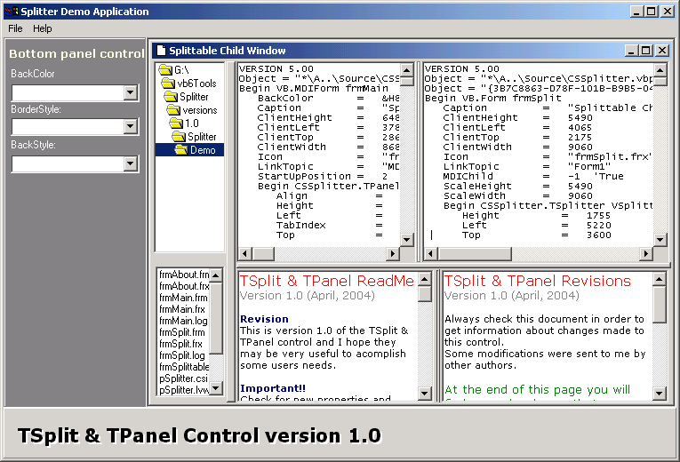



## Split control 1\.0

### Description

TSplit and TPanel control version 1.0. Add spliting capabilities to your MDI and SDI applications.
 
### More Info
 

             |
---                |---
**Submitted On**   |2004-04-18 09:46:00
**By**             |[Marclei V Silva](https://github.com/Planet-Source-Code/PSCIndex/blob/master/ByAuthor/marclei-v-silva.md)
**Level**          |Advanced
**User Rating**    |5.0 (40 globes from 8 users)
**Compatibility**  |VB 6\.0
**Category**       |[Complete Applications](https://github.com/Planet-Source-Code/PSCIndex/blob/master/ByCategory/complete-applications__1-27.md)
**World**          |[Visual Basic](https://github.com/Planet-Source-Code/PSCIndex/blob/master/ByWorld/visual-basic.md)
**Archive File**   |[Split\_cont1734764182004\.zip](https://github.com/Planet-Source-Code/marclei-v-silva-split-control-1-0__1-53236/archive/master.zip)

